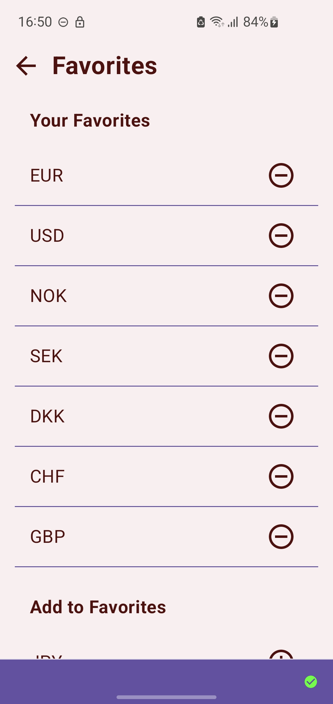

# Exchangify - Currency Converter - KMP

**Exchangify** - Currency Converter - KMP is a **Kotlin Multiplatform** project targeting Android, iOS and Desktop, built with Compose Multiplatform, Navigation Compose, Flow, Koin, Retrofit, Ktor, SqlDelight, DataStore, NSUserDefaults and Material3 based on MVVM architecture.

It is a simple yet powerful currency converter app designed to help you convert currencies effortlessly. The app uses real-time exchange rates to provide accurate conversions between a wide range of world currencies.

## Features

- Real-time currency conversion.
- Supports many world currencies.
- Easy-to-use, intuitive interface.
- Offline mode for conversion without internet connection (using the last fetched rates).
- Favorites list to quickly access your most-used currencies.

### Screenshots

    
&nbsp; &nbsp; &nbsp; &nbsp;
    
&nbsp; &nbsp; &nbsp; &nbsp;
    
&nbsp; &nbsp; &nbsp; &nbsp;
    
&nbsp; &nbsp; &nbsp; &nbsp;
    
&nbsp; &nbsp; &nbsp; &nbsp;
    

### Usage
Select the currency you want to convert from, enter the amount, and select the currency you want to convert to. The app will display the converted amount based on the current exchange rate.

## Tech Stack

This is a **Kotlin Multiplatform** project targeting Android, iOS and Desktop.

**Exchangify** - Currency Converter - KMP is built using a modern stack of technologies designed to offer robust performance and scalability:
- **Compose Multiplatform**: For building native UIs.
- **Retrofit**: For Android network operations.
- **Ktor**: For iOS and Desktop network operations.
- **SQL Delight Database**: For local data storage.
- **MVVM (Model-View-ViewModel)**: Architectural pattern.
- **DI Koin**: Dependency injection.
- **DataStore**: For Android data storage and management.
- **NSUserDefaults**: For iOS data storage and management.
- **Navigation Compose**: For navigating between screens.
- **Material 3**: Latest Material Design components.

## Architecture

**Exchangify** - Currency Converter - KMP follows the [Google's official architecture guidance](https://developer.android.com/topic/architecture).
  

  
Exchangify - Currency Converter - KMP was built with [Guide to app architecture](https://developer.android.com/topic/architecture), so it would be a great sample to show how the architecture works in real-world projects.
  
The overall architecture is composed of two layers; UI Layer and the data layer. Each layer has dedicated components and they each have different responsibilities. The arrow means the component has a dependency on the target component following its direction.
  

### Architecture Overview
  

  
Each layer has different responsibilities below. Basically, they follow [unidirectional event/data flow](https://developer.android.com/topic/architecture/ui-layer#udf).
  

### UI Layer
  

  
The UI Layer consists of UI elements like buttons, menus, tabs that could interact with users and [ViewModel](https://developer.android.com/topic/libraries/architecture/viewmodel) that holds app states and restores data when configuration changes.
  

### Data Layer
  

  
The data Layer consists of repositories, which include business logic, such as querying data from the local database and requesting remote data from the network. It is implemented as an offline-first source of business logic and follows the [single source of truth](https://en.wikipedia.org/wiki/Single_source_of_truth) principle.

### License
Designed and developed by Vladan Mitkovic (2024)

Licensed under the Apache License, Version 2.0 (the "License");
you may not use this file except in compliance with the License.
You may obtain a copy of the License at

http://www.apache.org/licenses/LICENSE-2.0

Unless required by applicable law or agreed to in writing, software
distributed under the License is distributed on an "AS IS" BASIS,
WITHOUT WARRANTIES OR CONDITIONS OF ANY KIND, either express or implied.
See the License for the specific language governing permissions and
limitations under the License.
